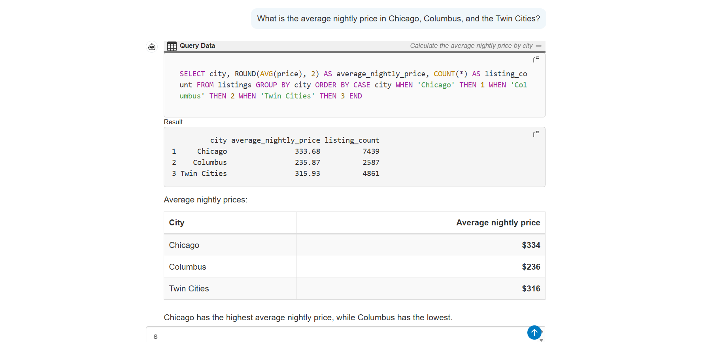
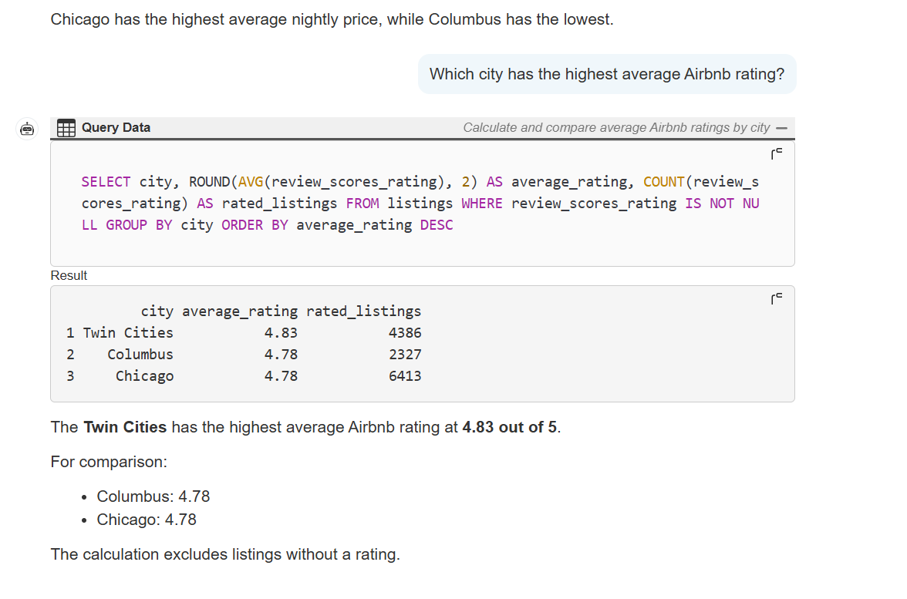
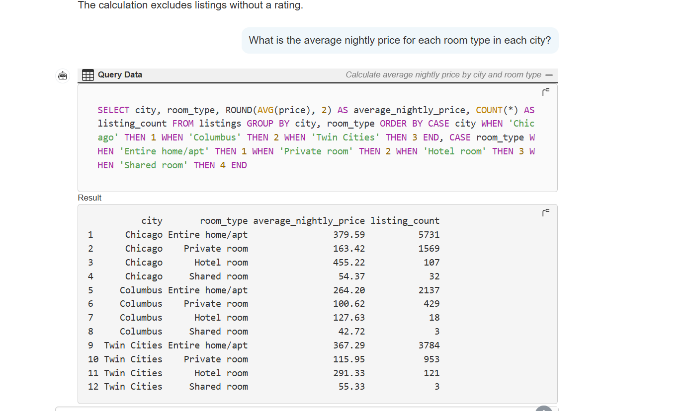

# Midwest Airbnb Explorer

**Ask questions about Midwest Airbnb listings in plain English and get the SQL and results back.**

This QueryChat app was created for ISA 401 at Miami University. It explores Airbnb listings from Chicago, Columbus, and the Twin Cities using a SQLite database and natural-language questions.

**Live app:** https://midwest-airbnb-chat-hqlr.onrender.com

---

## Example Questions

### 1. What is the average nightly price in Chicago, Columbus, and the Twin Cities?

### 2. Which city has the highest average Airbnb rating?

### 3. What is the average nightly price for each room type in each city?

---

## What is this app?

The app connects to the Midwest Airbnb SQLite database and uses QueryChat to let users ask questions about Airbnb listings in plain English. The app translates questions into SQL and displays the results along with the SQL query that was used.

Users can explore information about prices, ratings, availability, hosts, room types, and other listing details.

---

## Dataset Information

The dataset contains Airbnb listings from:

- Chicago
- Columbus
- Twin Cities

The data dictionary is located in `data/data_desc.md`, and additional rules for the LLM are located in `data/extra_instructions.md`.

---

## Technology Stack

- **Shiny** - Web application framework for R
- **QueryChat** - Natural language data querying
- **ellmer** - LLM client for R
- **RSQLite** - SQLite database connection
- **bslib** - Styling and page layout

---

## Course Information

This application was developed for **ISA 401 at Miami University**.
